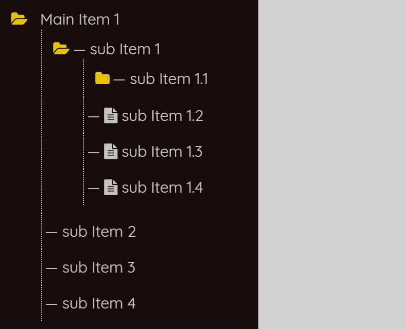

# jquery-treeNav
A lightweight jQuery plugin to generate Tree View Navigation from HTML nested lists.
## TreeNav Preview

## How to use:

1. Load the jQuery and Font Awesome in your HTML page.
```html
<!--jQuery-->
<script
  src="https://code.jquery.com/jquery-3.3.1.min.js"
  integrity="sha256-FgpCb/KJQlLNfOu91ta32o/NMZxltwRo8QtmkMRdAu8="
  crossorigin="anonymous"></script>

<!--Font Awesome-->
<link href="https://stackpath.bootstrapcdn.com/font-awesome/4.7.0/css/font-awesome.min.css" rel="stylesheet" integrity="sha384-wvfXpqpZZVQGK6TAh5PVlGOfQNHSoD2xbE+QkPxCAFlNEevoEH3Sl0sibVcOQVnN" crossorigin="anonymous">
```
2. Also include Tree Nav javascript and CSS files.
```html
<!--Tree Nav CSS-->
<link rel="stylesheet" href="css/tree-nav.css" />
 <!--Tree Nav Js-->
 <script src="js/jquery.treenav.js"></script>
```
3. Create HTML nested unordered list for tree nav. Add the attribute data-type="folder" to the parent li that has child ul.
```html
 <nav class="tree-nav default">
     <ul class="main-items">
       <li data-type="folder">
               <a href="#1"> Main Item </a>
               <ul>
                  <li><a href="#1"> Sub Item </a> </li>
                  <li><a href="#1"> Sub Item </a> </li>
                 ---------------------------
                 ---------------------------
               </ul>
            </li>
         </ul>
</nav>
```
4. Call the plugin into jQuery document ready function to active the tree navigation.
```javascript
$(document).ready(function(){
$(".tree-nav").treeNav();
});
```
## Author 
Asif Mughal <br>
URL: www.codehim.com
